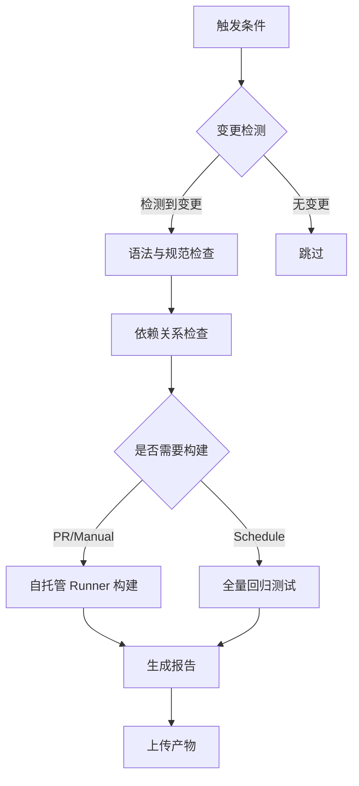
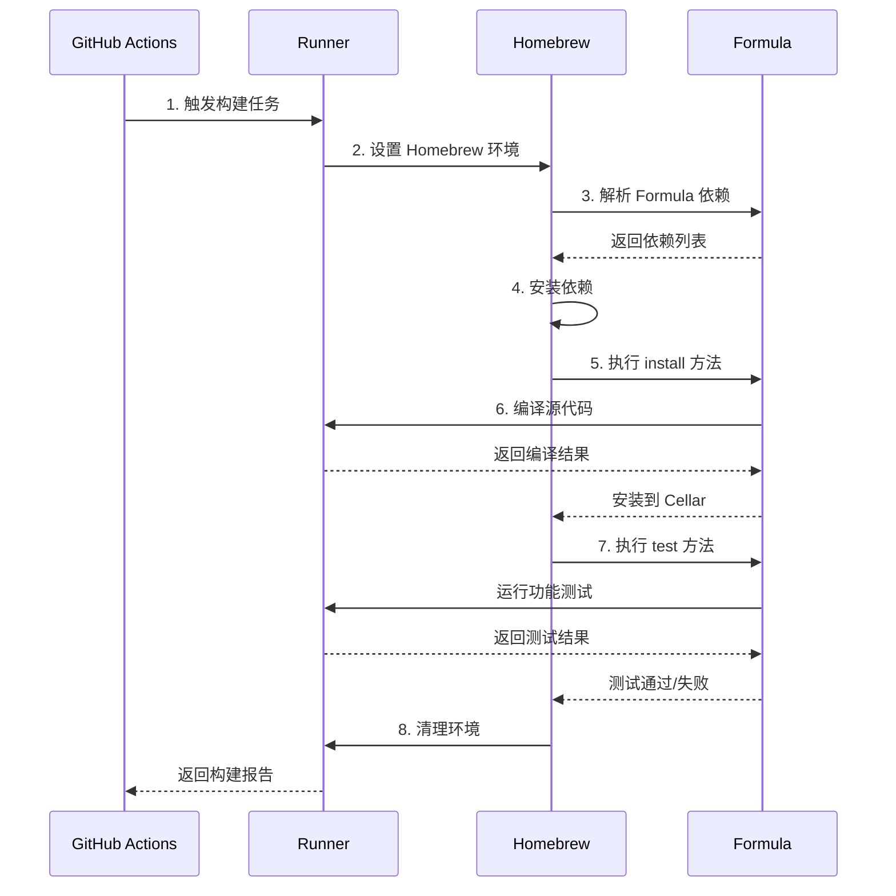

# Homebrew Loong64 Tap CI 架构说明

## 1. 架构概述

### 1.1 设计目标

针对 LoongArch64 (龙芯) 架构的特殊性，本 CI 方案设计目标如下：

| 目标 | 说明 |
|------|------|
| **语法正确性** | 确保 Formula Ruby 语法正确，符合 Homebrew 规范 |
| **依赖完整性** | 验证依赖关系，避免循环依赖和缺失依赖 |
| **构建可行性** | 在真实 LoongArch64 环境中验证构建 |
| **快速反馈** | PR 阶段快速发现问题，减少等待时间 |

### 1.2 核心挑战与解决方案

```
┌─────────────────────────────────────────────────────────────────┐
│                    LoongArch64 CI 挑战                          │
├─────────────────────────────────────────────────────────────────┤
│                                                                 │
│  挑战 1: 无原生 GitHub Actions Runner                          │
│  ┌────────────────────────────────────────────────────────┐    │
│  │ 解决方案: 混合架构                                      │    │
│  │ • x86_64 Runner: 语法检查、依赖分析、审计              │    │
│  │ • 自托管 Runner (LoongArch64): 实际构建测试            │    │
│  └────────────────────────────────────────────────────────┘    │
│                                                                 │
│  挑战 2: 构建资源受限                                          │
│  ┌────────────────────────────────────────────────────────┐    │
│  │ 解决方案: 智能调度                                      │    │
│  │ • 仅测试变更的 Formula                                  │    │
│  │ • 按类别分组并行构建                                    │    │
│  │ • 支持手动跳过构建                                      │    │
│  └────────────────────────────────────────────────────────┘    │
│                                                                 │
│  挑战 3: 依赖环境特殊                                          │
│  ┌────────────────────────────────────────────────────────┐    │
│  │ 解决方案: 环境适配                                      │    │
│  │ • 使用 AOSC OS 系统库                                   │    │
│  │ • systemd-nspawn 容器隔离                              │    │
│  │ • 精简依赖链                                            │    │
│  └────────────────────────────────────────────────────────┘    │
│                                                                 │
└─────────────────────────────────────────────────────────────────┘
```

## 2. 工作流结构

### 2.1 触发条件

```yaml
on:
  push:
    branches: [main, master]          # 主分支推送
    paths: [Formula/**, .github/**]   # 仅 Formula 或 CI 变更时
  pull_request:
    branches: [main, master]          # PR 到主分支
  schedule:
    - cron: '0 2 * * 1'               # 每周一凌晨 2 点定时
  workflow_dispatch:                  # 手动触发
```

### 2.2 阶段设计



### 2.3 任务矩阵

| 任务 | Runner | 触发条件 | 耗时 | 优先级 |
|------|--------|----------|------|--------|
| `detect_changes` | ubuntu-latest | 总是 | <10s | P0 |
| `audit` | ubuntu-latest | 有变更 | ~1min | P0 |
| `dependency_check` | ubuntu-latest | 有变更 | ~1min | P1 |
| `build_test` | self-hosted | PR/Manual | 10-120min | P1 |
| `regression_test` | self-hosted | Schedule | 2-5h | P2 |
| `report` | ubuntu-latest | 总是 | <10s | P2 |

## 3. 包类别分组策略

### 3.1 类别定义

基于 23 个 Formula，按构建特性和依赖关系分为 5 组：

```yaml
matrix:
  include:
    - category: "core-tools"
      formulas: "curl wget git"
      # 特性: 网络工具，通常依赖 openssl
      # 预估时间: 15-30 分钟
      
    - category: "editors"
      formulas: "vim nano micro"
      # 特性: 文本编辑器，依赖 ncurses
      # 预估时间: 20-40 分钟
      
    - category: "shells"
      formulas: "fish"
      # 特性: 交互式 shell，构建复杂
      # 预估时间: 30-60 分钟
      
    - category: "dev-tools"
      formulas: "jq tmux htop ccache ninja fd ripgrep bat fzf"
      # 特性: 开发工具，Rust/Go 项目较多
      # 预估时间: 40-90 分钟
      
    - category: "system-libs"
      formulas: "gettext gmp berkeley-db@5 oniguruma unzip perl binutils"
      # 特性: 系统库，部分使用预编译系统库
      # 预估时间: 20-50 分钟
```

### 3.2 分组理由

```
┌────────────────────────────────────────────────────────────────┐
│                    分组策略说明                                 │
├────────────────────────────────────────────────────────────────┤
│                                                                │
│  1. 核心网络工具 (core-tools)                                  │
│     • curl: 基础 HTTP 库，多个包依赖                           │
│     • wget: 下载工具，依赖链简单                               │
│     • git: 版本控制，本仓库必需                                │
│     → 优先构建，作为基础依赖                                   │
│                                                                │
│  2. 文本编辑器 (editors)                                       │
│     • vim: 功能丰富，Python 支持                               │
│     • nano: 轻量级，构建快速                                   │
│     • micro: Go 编写，依赖少                                   │
│     → 并行构建，互不干扰                                       │
│                                                                │
│  3. 开发工具集 (dev-tools)                                     │
│     • ripgrep, fd, bat, fzf: Rust 项目                         │
│     • jq: C 项目，JSON 处理                                    │
│     • ninja: 构建工具                                          │
│     → Rust 工具链共享，一起构建效率高                          │
│                                                                │
│  4. 系统库 (system-libs)                                       │
│     • gmp, berkeley-db@5: 使用系统预编译库                     │
│     • perl: 语言运行时                                         │
│     → 安装速度快，适合快速验证                                 │
│                                                                │
└────────────────────────────────────────────────────────────────┘
```

## 4. 自托管 Runner 配置

### 4.1 硬件要求

```yaml
# 推荐的 LoongArch64 Runner 配置
runner:
  hardware:
    cpu: "Loongson 3A5000 / 3A6000"
    cores: "4-8 cores"
    memory: "16GB+ RAM"
    storage: "100GB+ SSD"
    os: "AOSC OS / LoongArch Linux"
  
  software:
    homebrew: "/home/linuxbrew/.linuxbrew"
    gcc: "15.0+"
    ruby: "3.0+"
    systemd_nspawn: "enabled"
```

### 4.2 Runner 标签策略

```yaml
# .github/workflows/tests.yml 中指定
runs-on: self-hosted

# 或者使用标签进行更精细控制
runs-on: [self-hosted, loongarch64, linux]
```

### 4.3 安全配置

```bash
#!/bin/bash
# 注册自托管 Runner 脚本 (setup-runner.sh)

# 1. 创建专用用户
sudo useradd -m -s /bin/bash brew-runner

# 2. 配置 systemd-nspawn 容器
sudo mkdir -p /var/lib/machines/brew-ci
sudo pacstrap -i /var/lib/machines/brew-ci base-devel

# 3. 在容器内安装 Homebrew
systemd-nspawn -D /var/lib/machines/brew-ci -u brew-runner \
  /bin/bash -c '/bin/bash -c "$(curl -fsSL https://raw.githubusercontent.com/Homebrew/install/HEAD/install.sh)"'

# 4. 注册 GitHub Actions Runner
cd /home/brew-runner/actions-runner
./config.sh --url https://github.com/HougeLangley/homebrew-loong64 --token $TOKEN
sudo ./svc.sh install brew-runner
sudo ./svc.sh start
```

## 5. 测试步骤详解

### 5.1 标准测试流程



### 5.2 错误处理策略

| 错误类型 | 检测方式 | 处理策略 |
|----------|----------|----------|
| 语法错误 | `ruby -c` | 立即失败，阻断后续步骤 |
| 审计警告 | `brew audit` | 警告级别，记录但不阻断 |
| 依赖缺失 | `brew deps` | 失败，需要修复 Formula |
| 编译错误 | `brew install` | 失败，检查源码兼容性 |
| 测试失败 | `brew test` | 失败，检查 test 块逻辑 |
| 超时 | `timeout-minutes` | 失败，可能是性能问题 |

## 6. 监控与报告

### 6.1 报告生成

```yaml
report:
  artifacts:
    - build-logs/          # 完整构建日志
    - test-results.json    # 结构化测试结果
    - dependency_graph.md  # 依赖关系图
    - ci-report.md         # 汇总报告
```

### 6.2 通知集成

```yaml
# 可选：添加 Slack/Email 通知
- name: 通知失败
  if: failure()
  uses: slack-action@v1
  with:
    message: "❌ CI 失败: ${{ github.sha }}"
    channel: "#brew-ci"
```

## 7. 扩展性考虑

### 7.1 多架构支持

未来若 GitHub 支持 LoongArch64 runner，可扩展：

```yaml
strategy:
  matrix:
    arch: [loongarch64, x86_64]
    runner: 
      loongarch64: [self-hosted, loong64]
      x86_64: [ubuntu-latest]
```

### 7.2 缓存优化

```yaml
- name: 缓存 Homebrew
  uses: actions/cache@v4
  with:
    path: |
      ~/Library/Caches/Homebrew
      /home/linuxbrew/.linuxbrew/Cellar
    key: brew-${{ runner.os }}-${{ hashFiles('Formula/**/*.rb') }}
```

## 8. 故障排查指南

### 8.1 常见问题

```
Q: 自托管 Runner 离线怎么办？
A: CI 会自动跳过构建测试，仅运行语法检查。检查 Runner 状态：
   sudo systemctl status actions.runner.*

Q: 构建超时如何处理？
A: 调整 timeout-minutes，或使用 ccache 加速。

Q: 依赖循环如何检测？
A: CI 会自动生成依赖图，检查是否存在循环：
   brew deps --tree formula
```

### 8.2 调试模式

手动触发时启用详细日志：

```bash
# workflow_dispatch 输入参数
inputs:
  debug:
    description: '启用调试模式'
    type: boolean
    default: false

# 在步骤中使用
- run: |
    if [ "${{ inputs.debug }}" = "true" ]; then
      set -x
      export HOMEBREW_DEBUG=1
      export HOMEBREW_VERBOSE=1
    fi
```

## 9. 参考资源

- [Homebrew Formula Cookbook](https://docs.brew.sh/Formula-Cookbook)
- [GitHub Actions 文档](https://docs.github.com/actions)
- [自托管 Runner 配置](https://docs.github.com/en/actions/hosting-your-own-runners)
- [LoongArch ABI 文档](https://github.com/loongson/LoongArch-Documentation)
